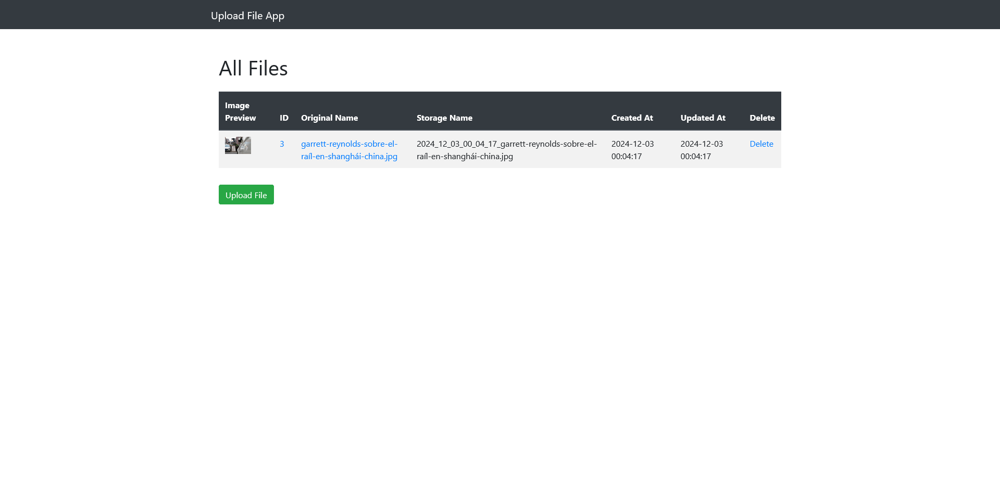
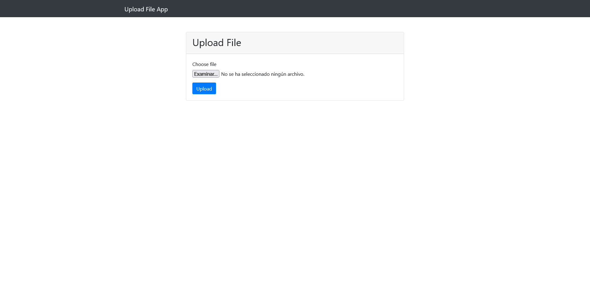
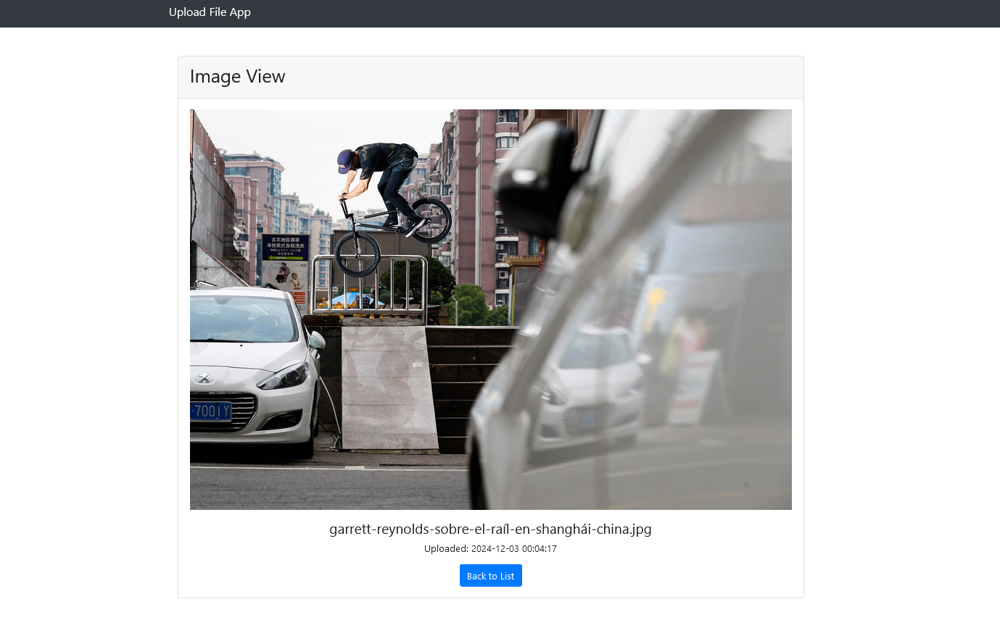
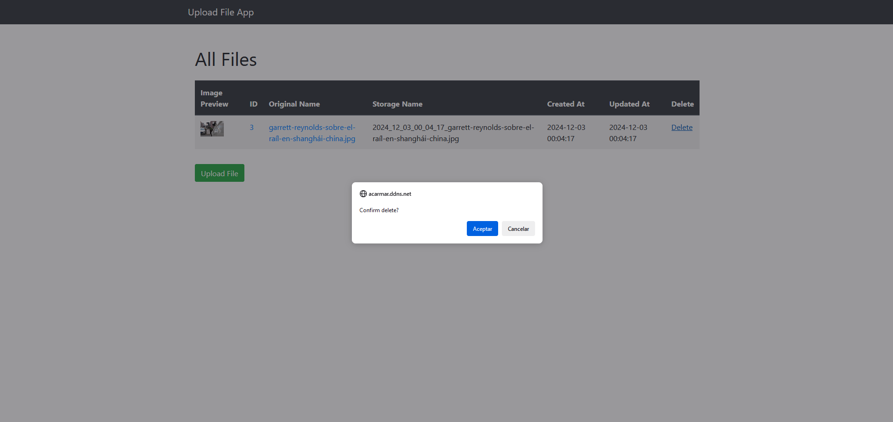

# Upload_File_App
Aplicación para subida de archivos en Laravel con base de datos

## Contenido

- [Base de datos](#base-de-datos)  
- [Guardado de archivos](#guardado-de-archivos)  
- [Rutas](#rutas)  
- [Vistas](#vistas)  
- [Controlador](#controlador)  
- [Javascript](#javascript)  
- [Aspecto de la aplicación](#aspecto-de-la-aplicación)  

<br>

## Base de datos

Tabla `upload`.

```php
<?php
Schema::create('upload', function (Blueprint $table) {
    $table->id();
    $table->string('original_name');
    $table->string('storage_name')->unique();
    $table->timestamps();
});
```

<br>

## Guardado de archivos

Los archivos se van a guardar en el directorio `storage/app/private/exercise/`.

<br>

## Rutas

```php
<?php
Route::get('/', [UploadController::class, 'index'])->name('upload.index');
Route::get('/create', [UploadController::class, 'create'])->name('upload.create');
Route::post('/upload', [UploadController::class, 'store'])->name('upload.store');
Route::get('image/{id}', [UploadController::class, 'image'])->name('upload.image');
Route::get('show/{file}', [UploadController::class, 'show'])->name('upload.show');
Route::delete('delete/{id}', [UploadController::class, 'destroy'])->name('upload.destroy');
```

<br>

## Vistas

- `base.blade.php`: Main layout template
- `upload/create.blade.php`: Formulario de subida
- `upload/index.blade.php`: Lista de archivos subidos
- `upload/show.blade.php`: Vista individual

<br>

## Controlador

El controlador UploadController se encarga de todas las operaciones:

- `index()`: Muestrar todos los archivos o redirige a la creación si no hay ninguna entrada
- `create()`: Mostrar el formulario de subida
- `store()`: Manejar la carga de archivos
- `show()`: Muestrar un archivo individual
- `image()`: Muestrar un archivo individual
- `destroy()`: Eliminar archivo

<br>

## Javascript

Los archivos y entradas de la base de datos se eliminan mediante `public/assets/scripts/script.js`.  
Tiene las siguientes funcionalidades:

- Captura los click events en los enlaces *delete*.
- Muestra el cuadro de diálogo de confirmación.

<br>

## Aspecto de la aplicación

Página principal:



<br>

Página de subida de archivos:



<br>

Página de visionado de imagen:



<br>

Borrado de archivo y entrada a la base de datos:

